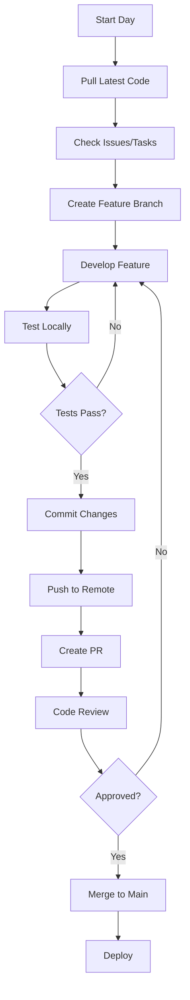
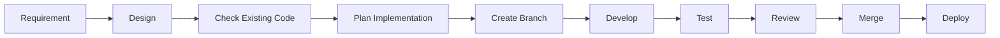
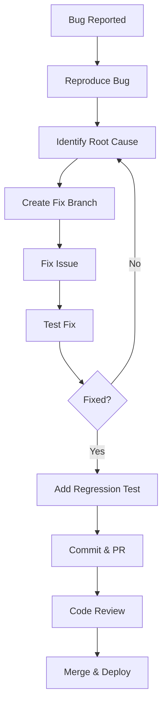
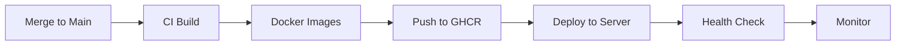

# Complete Workflow Guide

> **Quy trình làm việc hoàn chỉnh cho Car Rental Project**

## 📋 Table of Contents

- [Initial Setup](#initial-setup)
- [Development Workflow](#development-workflow)
- [Git Workflow](#git-workflow)
- [Feature Development](#feature-development)
- [Bug Fixing](#bug-fixing)
- [Code Review](#code-review)
- [Testing & Quality](#testing--quality)
- [Deployment Workflow](#deployment-workflow)
- [Team Collaboration](#team-collaboration)

---

## 🚀 Initial Setup

### 1. First-Time Project Setup

```bash
# 1. Clone repository
git clone https://github.com/zonprox/carental.git
cd carental

# 2. Install dependencies
npm install

# 3. Setup environment
cp .env.example .env
# Edit .env with your settings

# 4. Start database
cd infra/docker
docker-compose up -d db
cd ../..

# 5. Run migrations
cd server
npm run prisma:generate
npm run migrate:dev
npm run seed  # Optional: Add sample data
cd ..

# 6. Start development
npm run dev
# Client: http://localhost:5173
# Server: http://localhost:4000
```

### 2. First-Run Application Setup

```bash
# 1. Visit setup page
open http://localhost:5173/setup

# 2. Complete setup wizard:
#    - App URL & Ports
#    - Database configuration
#    - Admin account creation

# 3. Login as admin
#    Email: admin@example.com (from setup)
#    Password: (from setup)

# 4. Verify setup
#    - Check admin dashboard
#    - Test CRUD operations
#    - Upload test documents
```

---

## 💻 Development Workflow

### Daily Development Routine



### Step-by-Step Development

#### 1. **Morning Routine**

```bash
# Pull latest changes
git checkout main
git pull origin main

# Update dependencies (if needed)
npm install

# Start development servers
npm run dev
```

#### 2. **Check Your Tasks**

- Review assigned GitHub Issues
- Check project board
- Prioritize tasks for the day
- Communicate with team

#### 3. **Start Development**

```bash
# Create feature branch
git checkout -b feature/your-feature-name

# Or bug fix branch
git checkout -b fix/bug-description
```

#### 4. **Development Process**

```bash
# Make changes following guidelines
# See DEVELOPMENT_GUIDE.md

# Check for reusable code first!
# See CODE_REFERENCE.md

# Run linter frequently
npm run lint

# Test your changes
# - Manual testing in browser
# - Check console for errors
# - Test different screen sizes
```

#### 5. **Before Committing**

```bash
# Lint check
npm run lint

# Build check
npm run build

# Review your changes
git diff

# Stage specific files
git add <files>
```

#### 6. **Commit Changes**

```bash
# Follow conventional commits
git commit -m "feat: add user profile page"
git commit -m "fix: resolve login redirect issue"
git commit -m "docs: update API documentation"
git commit -m "refactor: extract common table component"
git commit -m "style: fix button alignment"
git commit -m "chore: update dependencies"
```

#### 7. **Push and Create PR**

```bash
# Push to remote
git push origin feature/your-feature-name

# Create PR on GitHub
# - Clear title and description
# - Link related issues
# - Add screenshots if UI changes
# - Request reviewers
```

---

## 🌿 Git Workflow

### Branch Strategy

```
main (production-ready code)
  └── feature/* (new features)
  └── fix/* (bug fixes)
  └── refactor/* (code improvements)
  └── docs/* (documentation)
```

### Branch Naming Convention

```bash
# Features
feature/user-authentication
feature/booking-calendar
feature/payment-integration

# Bug fixes
fix/login-redirect
fix/car-image-upload
fix/booking-validation

# Refactoring
refactor/api-client
refactor/admin-layout
refactor/database-queries

# Documentation
docs/api-endpoints
docs/deployment-guide
docs/component-usage

# Chores
chore/update-dependencies
chore/cleanup-unused-code
```

### Commit Message Convention

```bash
# Format: <type>(<scope>): <subject>

# Types:
feat:     # New feature
fix:      # Bug fix
docs:     # Documentation only
style:    # Formatting, missing semicolons, etc
refactor: # Code change that neither fixes bug nor adds feature
perf:     # Performance improvement
test:     # Adding missing tests
chore:    # Updating build tasks, package manager configs, etc

# Examples:
git commit -m "feat(auth): add JWT refresh token"
git commit -m "fix(booking): validate date range"
git commit -m "docs(api): add booking endpoints"
git commit -m "refactor(ui): extract reusable card component"
git commit -m "style(admin): fix dashboard spacing"
git commit -m "chore(deps): update React to 18.3.1"
```

### Pull Request Process

#### Creating PR

```markdown
## Description
Brief description of changes

## Changes Made
- Added user profile page
- Implemented document upload
- Added verification status badge

## Related Issues
Closes #123
Related to #456

## Screenshots (if applicable)
[Add screenshots here]

## Checklist
- [ ] Code follows style guidelines
- [ ] Self-review completed
- [ ] No console errors
- [ ] Responsive design tested
- [ ] Documentation updated
- [ ] Reused existing components
```

#### Code Review Checklist

**Reviewer should check:**
- [ ] Code follows DEVELOPMENT_GUIDE.md
- [ ] Reuses existing components/utilities
- [ ] No duplicate code
- [ ] Proper TypeScript types
- [ ] Error handling present
- [ ] Loading states added
- [ ] Responsive design
- [ ] No console errors/warnings
- [ ] Clear variable/function names
- [ ] Comments where needed
- [ ] No sensitive data exposed

---

## ✨ Feature Development

### Complete Feature Development Flow



### Step-by-Step Process

#### 1. **Understand Requirements**

```markdown
## Feature: User Document Verification

### Requirements:
- Users can upload ID card and driver's license
- Admin can view pending verifications
- Admin can approve/reject documents
- Users get notified of verification status

### Acceptance Criteria:
- [ ] Upload functionality works
- [ ] Admin sees pending list
- [ ] Status updates correctly
- [ ] UI is responsive
- [ ] Error handling present
```

#### 2. **Check Existing Code**

```bash
# Before writing ANY code, check:

# 1. Similar features
grep -r "upload" client/src/

# 2. Reusable components
# Check CODE_REFERENCE.md

# 3. API methods
# Check client/src/lib/api.ts

# 4. Database schema
# Check server/prisma/schema.prisma

# 5. Similar pages
# Check existing pages for patterns
```

#### 3. **Plan Implementation**

```markdown
## Implementation Plan

### Frontend:
1. Create upload component (or reuse existing)
2. Add API calls (check if exists first)
3. Add to profile page
4. Create admin verification page

### Backend:
1. Add upload endpoint (check middleware/upload.ts)
2. Add verification endpoints
3. Update user schema if needed

### Components to Reuse:
- Button, Input, Dialog from shadcn/ui
- Upload middleware from server
- AdminLayout for admin page

### New Components Needed:
- DocumentUploadCard (if not exists)
```

#### 4. **Implement Feature**

```tsx
// Example: Document Upload Component

// ✅ GOOD: Reuse existing components
import { Button } from '@/components/ui/button'
import { Input } from '@/components/ui/input'
import { Label } from '@/components/ui/label'
import { Card } from '@/components/ui/card'
import { toast } from 'sonner'
import { api } from '@/lib/api'

// ✅ GOOD: Follow established patterns
const DocumentUpload = () => {
  const [uploading, setUploading] = useState(false)

  const handleUpload = async (e: React.ChangeEvent<HTMLInputElement>) => {
    const file = e.target.files?.[0]
    if (!file) return
    
    setUploading(true)
    try {
      await api.users.uploadDocument('idCard', file)
      toast.success('Uploaded successfully')
    } catch (error: any) {
      toast.error('Error', { description: error.message })
    } finally {
      setUploading(false)
    }
  }

  return (
    <Card className="p-6">
      <Label>ID Card</Label>
      <Input 
        type="file" 
        onChange={handleUpload} 
        disabled={uploading}
      />
    </Card>
  )
}
```

#### 5. **Test Thoroughly**

```bash
# Test checklist:
- [ ] Happy path works
- [ ] Error cases handled
- [ ] Loading states work
- [ ] Validation works
- [ ] Responsive on mobile
- [ ] Works in different browsers
- [ ] No console errors
- [ ] Network errors handled
```

#### 6. **Document Changes**

```markdown
# Update relevant docs if needed:

# If new API endpoint:
- Update API_DOCUMENTATION.md

# If new reusable component:
- Update CODE_REFERENCE.md

# If new pattern:
- Update DEVELOPMENT_GUIDE.md
```

---

## 🐛 Bug Fixing

### Bug Fix Workflow



### Bug Fixing Process

#### 1. **Reproduce the Bug**

```markdown
## Bug Report Template

### Description:
Login redirect not working after authentication

### Steps to Reproduce:
1. Go to /auth/login
2. Enter credentials
3. Click login
4. Observe: stays on login page

### Expected:
Redirect to dashboard

### Actual:
No redirect happens

### Environment:
- Browser: Chrome 120
- OS: Windows 11
- User Role: Admin
```

#### 2. **Debug the Issue**

```tsx
// Add console logs to trace
console.log('Login response:', data)
console.log('User role:', data.user.isAdmin)
console.log('Navigation triggered')

// Check network tab
// Check React DevTools
// Check browser console
```

#### 3. **Identify Root Cause**

```tsx
// ❌ BAD CODE (found the bug)
const handleLogin = async () => {
  const data = await api.auth.login(credentials)
  if (data.user.isAdmin) {
    navigate('/admin')  // Missing else case!
  }
}

// Root cause: No redirect for non-admin users
```

#### 4. **Fix the Bug**

```tsx
// ✅ GOOD FIX
const handleLogin = async () => {
  const data = await api.auth.login(credentials)
  if (data.user.isAdmin) {
    navigate('/admin')
  } else {
    navigate('/') // Fixed: redirect regular users
  }
}
```

#### 5. **Test the Fix**

```bash
# Test checklist:
- [ ] Original bug is fixed
- [ ] Admin users still redirect correctly
- [ ] Regular users now redirect correctly
- [ ] No new bugs introduced
- [ ] Edge cases tested
```

#### 6. **Prevent Regression**

```tsx
// Add defensive code
const handleLogin = async () => {
  try {
    const data = await api.auth.login(credentials)
    
    // Ensure redirect happens
    const destination = data.user.isAdmin ? '/admin' : '/'
    navigate(destination)
    
    toast.success('Login successful')
  } catch (error: any) {
    toast.error('Login failed', { description: error.message })
  }
}
```

---

## 👥 Code Review

### Review Process

#### For Author (Submitting PR)

```markdown
## Pre-Review Checklist

Before requesting review:
- [ ] Self-review completed
- [ ] Lint passes (npm run lint)
- [ ] Build succeeds (npm run build)
- [ ] Manual testing done
- [ ] Screenshots added (for UI)
- [ ] Documentation updated
- [ ] Code reuse maximized
- [ ] No console logs left
- [ ] No commented code
- [ ] Clear commit messages
```

#### For Reviewer

```markdown
## Review Checklist

### Code Quality:
- [ ] Follows DEVELOPMENT_GUIDE.md
- [ ] Reuses existing components
- [ ] No code duplication
- [ ] Clear naming
- [ ] Proper TypeScript types
- [ ] Error handling present

### Functionality:
- [ ] Features work as described
- [ ] Edge cases handled
- [ ] Loading states present
- [ ] Error states present

### UI/UX:
- [ ] Responsive design
- [ ] Consistent with app style
- [ ] Uses shadcn/ui components
- [ ] Proper spacing/layout

### Best Practices:
- [ ] No security issues
- [ ] No performance issues
- [ ] Accessibility considered
- [ ] Documentation updated
```

### Review Comments Examples

```markdown
# ✅ Good Review Comments

## Suggestion:
Consider extracting this into a reusable component:
We have a similar pattern in CarCard.tsx that could be reused here.

## Question:
What happens if the API call fails? 
Should we show an error toast?

## Nitpick:
Could we use the existing `cn()` utility instead of template strings?

## Security:
Should we validate this input before sending to API?

## Performance:
This re-renders on every keystroke. 
Consider debouncing the search input.

# ❌ Bad Review Comments

"This is wrong" (not helpful)
"I don't like this" (not constructive)
"Change everything" (too vague)
```

---

## ✅ Testing & Quality

### Manual Testing Checklist

#### Before Every Commit

```markdown
- [ ] No console errors
- [ ] No console warnings
- [ ] Lint passes (npm run lint)
- [ ] Build succeeds (npm run build)
- [ ] Features work in Chrome
- [ ] Features work in Firefox
- [ ] Mobile responsive
- [ ] Dark mode works (if applicable)
```

#### Before Every PR

```markdown
- [ ] All acceptance criteria met
- [ ] Edge cases tested
- [ ] Error scenarios tested
- [ ] Loading states verified
- [ ] Navigation works
- [ ] Forms validate correctly
- [ ] API errors handled gracefully
- [ ] No broken links
- [ ] Images load correctly
- [ ] Animations smooth
```

### Quality Assurance

```bash
# Run full quality check
npm run lint          # Check code style
npm run build         # Ensure builds

# Check for issues
# - Type errors
# - Unused imports
# - Console logs
# - TODO comments

# Browser testing
# - Chrome DevTools
# - Network tab (check API calls)
# - Console (check for errors)
# - React DevTools (check state)
```

---

## 🚀 Deployment Workflow

### Deployment Process



### Step-by-Step Deployment

#### 1. **Pre-Deployment**

```bash
# Ensure everything works locally
npm run lint
npm run build

# Test Docker build locally
cd infra/docker
docker-compose --profile prod build
docker-compose --profile prod up -d

# Test containers
curl http://localhost:4000/api/health
curl http://localhost:5173

# Stop test containers
docker-compose down
```

#### 2. **Merge to Main**

```bash
# 1. Ensure PR approved
# 2. Squash and merge (or merge commit)
# 3. Delete feature branch
# 4. Pull latest main locally

git checkout main
git pull origin main
```

#### 3. **CI/CD (Automatic)**

```yaml
# GitHub Actions automatically:
1. Builds Docker images
2. Pushes to ghcr.io
3. Tags with commit SHA
4. Updates :latest tag
```

#### 4. **Deploy to Production**

```bash
# On production server

# 1. Pull latest images
docker pull ghcr.io/zonprox/carental-server:latest
docker pull ghcr.io/zonprox/carental-client:latest

# 2. Update docker-compose
cd /path/to/app
docker-compose pull

# 3. Restart services
docker-compose up -d

# 4. Check health
curl https://your-domain.com/api/health

# 5. Monitor logs
docker-compose logs -f --tail 100
```

#### 5. **Post-Deployment**

```bash
# Verify deployment
- [ ] Health endpoint returns OK
- [ ] Login works
- [ ] Main features work
- [ ] No errors in logs
- [ ] Database connected
- [ ] File uploads work

# Monitor for issues
docker-compose logs -f server
docker-compose logs -f client

# Rollback if needed
docker-compose down
docker pull ghcr.io/zonprox/carental-server:previous-sha
docker-compose up -d
```

---

## 👥 Team Collaboration

### Communication

#### Daily Standup Format

```markdown
## Yesterday:
- Completed user profile page
- Fixed login redirect bug
- Reviewed 2 PRs

## Today:
- Implement document verification
- Update API documentation
- Code review for booking feature

## Blockers:
- Waiting for design approval on verification UI
- Need database migration review
```

### Task Management

```markdown
## GitHub Issues Template

### Feature Request:
**Title:** Add export booking data feature

**Description:**
As an admin, I want to export booking data to CSV so that I can analyze trends.

**Acceptance Criteria:**
- [ ] Export button on bookings page
- [ ] Generates CSV with all booking data
- [ ] Includes filters (date range, status)
- [ ] Downloads to user's computer

**Technical Notes:**
- Use existing Table component
- Add export utility
- Consider using papaparse library

**Priority:** Medium
**Labels:** feature, admin, enhancement
```

### Code Handoff

```markdown
## Handoff Document Template

### Feature: Document Verification System

**Files Changed:**
- client/src/pages/AdminVerificationPage.tsx
- client/src/pages/ProfilePage.tsx
- server/src/routes/users.ts

**Key Components:**
- DocumentUpload (reusable)
- VerificationTable (admin)

**API Endpoints:**
- POST /api/users/upload/:type
- GET /api/users/pending-verification
- POST /api/users/:id/verify

**Database Changes:**
- Added idCardImage field
- Added driverLicenseImage field
- Added isVerified field

**Known Issues:**
- None

**TODO:**
- Add email notifications (future)
- Add document preview modal (future)
```

---

## 📝 Documentation Updates

### When to Update Docs

```bash
# Update API_DOCUMENTATION.md when:
- Adding new API endpoint
- Changing endpoint behavior
- Modifying request/response format

# Update CODE_REFERENCE.md when:
- Creating reusable component
- Adding utility function
- New common pattern

# Update DEVELOPMENT_GUIDE.md when:
- New coding pattern
- Architecture change
- New best practice

# Update DEPLOYMENT.md when:
- Deployment process changes
- New environment variable
- Infrastructure update

# Update README.md when:
- Major feature addition
- Setup process changes
- Requirements change
```

---

## 🎯 Quick Reference Commands

### Development

```bash
npm run dev              # Start dev servers
npm run build            # Build production
npm run lint             # Lint code
npm run format           # Format code
```

### Database

```bash
npm run prisma:generate  # Generate Prisma client
npm run migrate:dev      # Run migrations (dev)
npm run migrate          # Run migrations (prod)
npm run seed             # Seed database
```

### Docker

```bash
# Development
docker-compose --profile dev up -d
docker-compose logs -f server

# Production
docker-compose --profile prod up -d
docker-compose ps
docker-compose down
```

### Git

```bash
git checkout -b feature/name    # New branch
git add .                       # Stage all
git commit -m "type: message"   # Commit
git push origin branch-name     # Push
git pull origin main            # Pull main
```

---

## 🎓 Best Practices Summary

### Golden Rules

1. ✅ **ALWAYS check existing code before writing new**
2. ✅ **Reuse components from CODE_REFERENCE.md**
3. ✅ **Follow patterns in DEVELOPMENT_GUIDE.md**
4. ✅ **Test locally before pushing**
5. ✅ **Write clear commit messages**
6. ✅ **Request reviews promptly**
7. ✅ **Update documentation**
8. ✅ **Communicate with team**

### Common Mistakes to Avoid

1. ❌ Writing duplicate code
2. ❌ Not testing error cases
3. ❌ Ignoring lint warnings
4. ❌ Not checking mobile responsive
5. ❌ Leaving console.logs
6. ❌ Not handling loading states
7. ❌ Using `any` type everywhere
8. ❌ Not documenting changes

---

**Last Updated:** October 23, 2025
**Version:** 1.0.0

---

## 📞 Need Help?

- Check documentation files
- Review existing similar code
- Ask team members
- Create GitHub issue
- Check Git history for context

**Remember:** Code reuse > New code!
